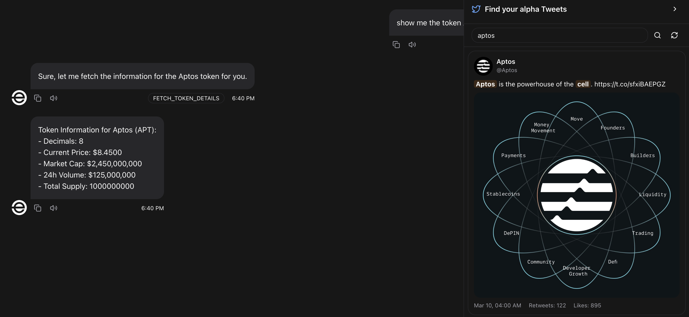
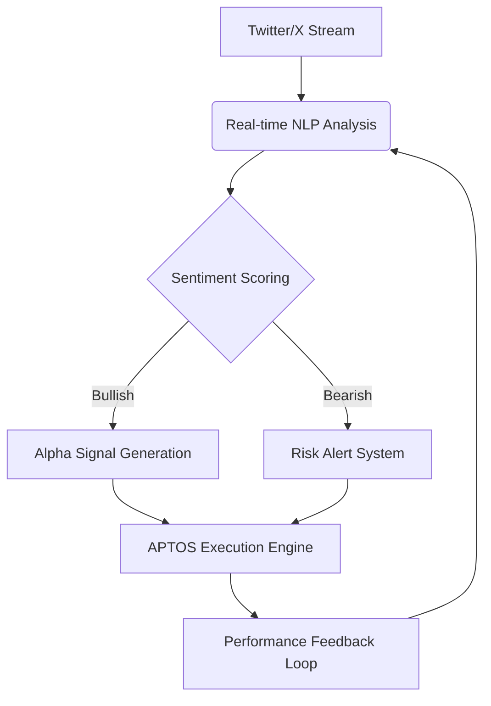

# AptosAlphaAgent 🔍🚀

<div align="center">
  
  <p><em>(AI Agent analyzing Twitter trends and executing on-chain transactions)</em></p>
</div>

## 🌟 Core Features Highlights

**AI-Powered Social Finance Intelligence Engine** - Real-time analysis of APTOS ecosystem alpha tweets on Twitter/X with:

- 🚨 Real-time market pulse monitoring
- 💎 Early-stage alpha opportunity detection
- 🤖 One-click on-chain execution
- 📊 Multi-dimensional token valuation
- 🧠 AI-powered sentiment analysis
- ⚖️ Bullish/Bearish tweet classification

## 🚀  Quick Start

### 1. Initialize Project
```bash
git clone https://github.com/your-repo/aptos-alpha-agent.git
cd aptos-alpha-agent
cp .env.example .env
```

### 2. Configure Environment
```env
# Wallet Config
APTOS_PRIVATE_KEY=your_private_key
```

### 3. Launch Agent
```bash
pnpm install
pnpm build
pnpm start --character ./characters/aptosOracle.character.json
```

### 4. Start Interaction
```bash
pnpm start:client
```
> Visit `http://localhost:3000` to begin



## 🔥 Core Features

### Real-Time Alpha Tweet Analysis
```bash
# Example: Monitor APT-related tweets
/analyze-tweets --token APT --timeframe 1h
```

### AI-Powered Sentiment Analysis
```bash
# Analyze tweet sentiment for specific token
/analyze-sentiment --token APT --tweet "Big partnership announcement coming soon!"
```
```text
📈 Sentiment Analysis Result:
- Bullish Probability: 92%
- Bearish Probability: 8%
- Confidence Score: 0.89
- Key Factors: "partnership", "announcement"
- Historical Accuracy: 86% on similar phrases

### Real-Time Impact Assessment
```bash
# Evaluate tweet impact on token price
/evaluate-impact --tweet-id 12345 --token APT
```
```text
⚖️ Impact Assessment:
- Predicted Price Impact: +8.5% (1h)
- Credibility Score: 94/100
- Author Influence: Tier 1 (500K+ followers)
- Historical Accuracy: 83%
- Market Correlation: 0.92

### Intelligent Token Insights
```bash
/show token-details CAKE --social --market
```
```text
🍰 CAKE Deep Dive:
- Price Trend: $3.45 (+8.2% 24h)
- Social Heat: Tweets ↑30%, "yield farming" mentions ↑40%
- On-chain: Large transfers increasing (>10K CAKE)
- Risk Assessment: Medium volatility, healthy holder distribution
- Sentiment Trend: Bullish (83% ↑12% weekly)

## 🧠 Technical Architecture



// Advanced sentiment analysis implementation
class AdvancedSentimentAnalyzer {
  async analyze(tweet: string): Promise<SentimentResult> {
    // Using ensemble model combining:
    // 1. FinBERT (Financial domain-specific BERT)
    // 2. Custom APTOS ecosystem model
    // 3. Market context analyzer
    const results = await Promise.all([
      this.finbertModel.predict(tweet),
      this.aptosModel.predict(tweet),
      this.marketContextAnalyzer.predict(tweet)
    ]);
    
    return this.ensembleVoting(results);
  }

  private ensembleVoting(results: Prediction[]): SentimentResult {
    // Implement weighted voting system based on model performance
    // Includes temporal relevance scoring
  }
}
```