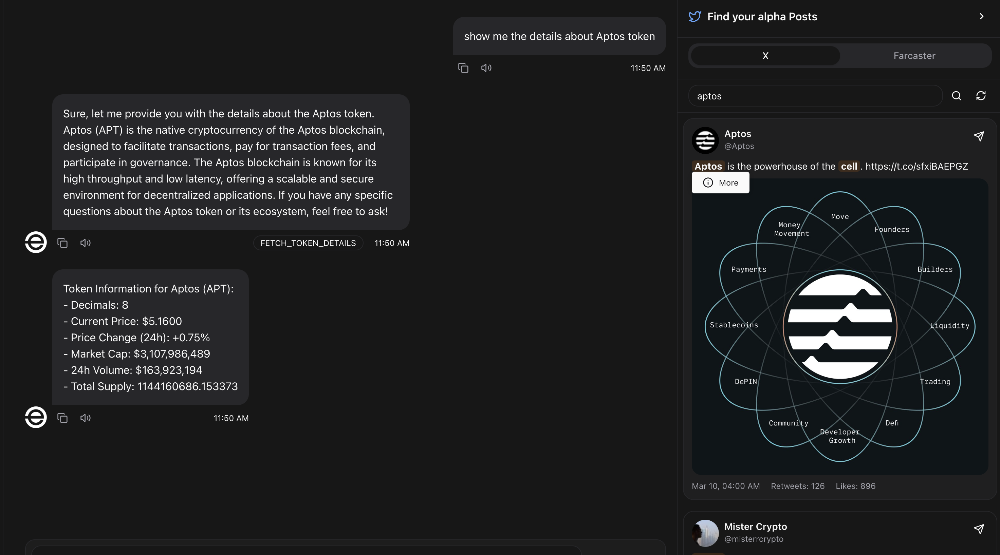
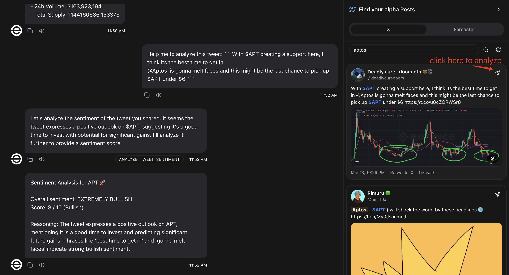
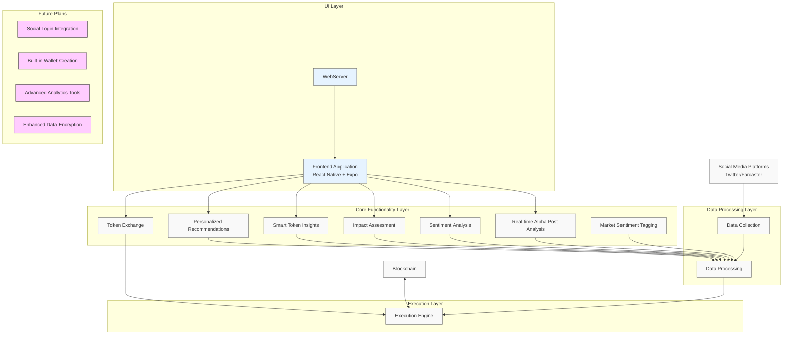

# AptosOracle 🔍🚀

<div align="center">
  
  <p><em>(AI Agent searching and analyzing alpha posts on social platform and executing on-chain transactions)</em></p>
</div>

## 🌟 Core Features Highlights

**AI-Powered Social Finance Intelligence Engine** - Real-time analysis of alpha posts on X/farcaster with:

- 🚨 Real-time market pulse monitoring
- 💎 Early-stage alpha opportunity detection
- 🤖 One-click on-chain execution
- 📊 Multi-dimensional token valuation
- 🧠 AI-powered sentiment analysis
- ⚖️ Bullish/Bearish post classification






## 🔥 Core Features

### Real-Time Alpha Posts Analysis


### AI-Powered Sentiment Analysis

```text
📈 Sentiment Analysis Result:
- Bullish Probability: 92%
- Bearish Probability: 8%
- Confidence Score: 0.89
- Key Factors: "partnership", "announcement"
- Historical Accuracy: 86% on similar phrases

### Real-Time Impact Assessment
```
# Evaluate post impact on token price

```text
⚖️ Impact Assessment:
- Predicted Price Impact: +8.5% (1h)
- Credibility Score: 94/100
- Author Influence: Tier 1 (500K+ followers)
- Historical Accuracy: 83%
- Market Correlation: 0.92

### Intelligent Token Insights

```text
🍰 CAKE Deep Dive:
- Price Trend: $3.45 (+8.2% 24h)
- Social Heat: Tweets ↑30%, "yield farming" mentions ↑40%
- On-chain: Large transfers increasing (>10K CAKE)
- Risk Assessment: Medium volatility, healthy holder distribution
- Sentiment Trend: Bullish (83% ↑12% weekly)

## 🔥 More Features

### Farcaster Alpha Casts
```
/find-alpha --platform farcaster --topics defi,nft,zkp
```
```text
🔍 Farcaster Alpha Analysis:
- 5 trending DeFi alpha casts from verified accounts
- 3 high-engagement ZKP innovation discussions
- Top influencers mentioning Aptos ecosystem: @0xJohn, @cryptobuilder
- Topic correlation: DeFi mentions increased 40% with APT price movement
- Cast sentiment: 85% positive, 12% neutral, 3% negative
```

### Personalized Alpha Recommendations
```
/recommend-alpha --based-on-history
```
```text
🎯 Personalized Recommendations:
- Trending: "APT staking solutions gaining traction" (93% relevance)
- Similar to your interests: New Move language deployment framework
- Based on your portfolio: 3 undervalued tokens with recent developer activity
- Community signals: Governance proposals you should track
- Whale watching: Key wallet movements related to your holdings
```

### Seamless Token Swap Experience
```
/swap APT USDC --amount 10
```
```text
💱 Token Swap Details:
- Swapping: 10 APT ➝ ~82.5 USDC
- Best route: APT → USDC (Liquidswap)
- Gas estimate: 0.002 APT
- Slippage: 0.3%
- Historical timing: Favorable (price up 2.4% vs 24h avg)
- One-click execution or schedule for target price
- Transaction confirmed: 0x742a...3d7f
```

### AI-Powered Market Sentiment Labeling
```
/label-sentiment --post-id 5432 --auto-batch
```
```text
🏷️ Sentiment Labeling Results:
- Analyzed: 25 recent posts (14 Twitter, 11 Farcaster)
- Bullish posts: 18 (72%) with avg. confidence 0.91
- Bearish posts: 5 (20%) with avg. confidence 0.87
- Neutral posts: 2 (8%) with avg. confidence 0.79
- Top bullish signals: "partnership", "mainnet launch", "institutional adoption"
- Top bearish signals: "delay announcement", "regulatory concerns"
- Sentiment trend: +15% more bullish than previous 24h
- Actionable insight: Strong positive shift detected for $APT ecosystem
```

## 🧠 Technical Architecture



### TODO List
- [ ] Integrate social login and create built-in wallet.
- [ ] Design user-friendly interface with React Native and Expo.
- [ ] Develop advanced analytics for sentiment analysis and trend prediction.
- [ ] Ensure data encryption for sensitive information.


## 🚀  Quick Start

### 1. Initialize Project
```bash
git clone https://github.com/your-repo/aptos-alpha-agent.git
cd aptos-alpha-agent
cp .env.example .env
```

### 2. Configure Environment
```env
# Wallet Config
APTOS_PRIVATE_KEY=your_private_key
```

### 3. Launch Agent
```bash
pnpm install
pnpm build
pnpm start --character ./characters/aptosOracle.character.json
```

### 4. Start Interaction
```bash
pnpm start:client
```
> Visit `http://localhost:3000` to begin